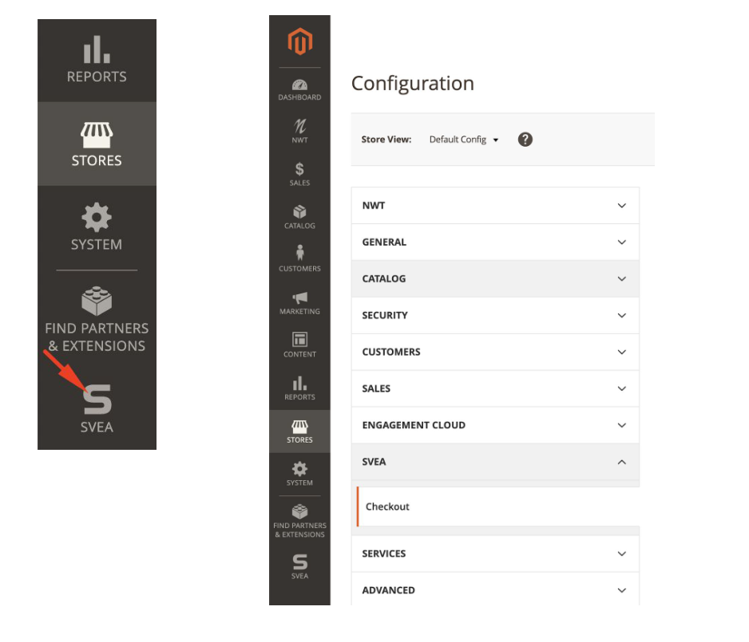
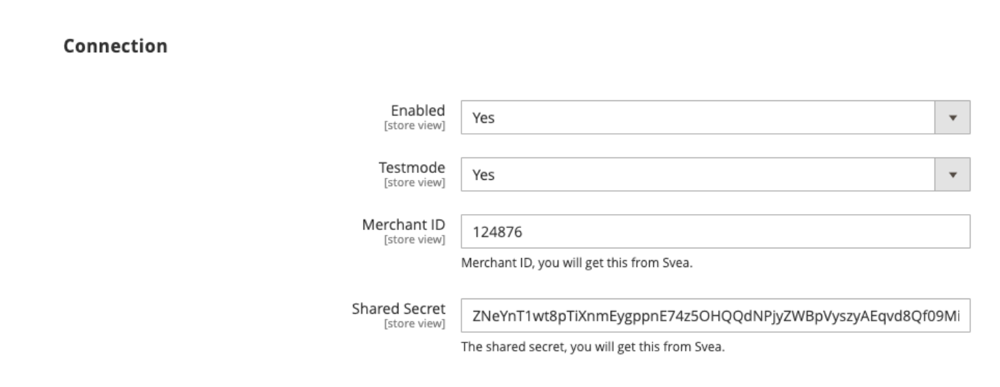
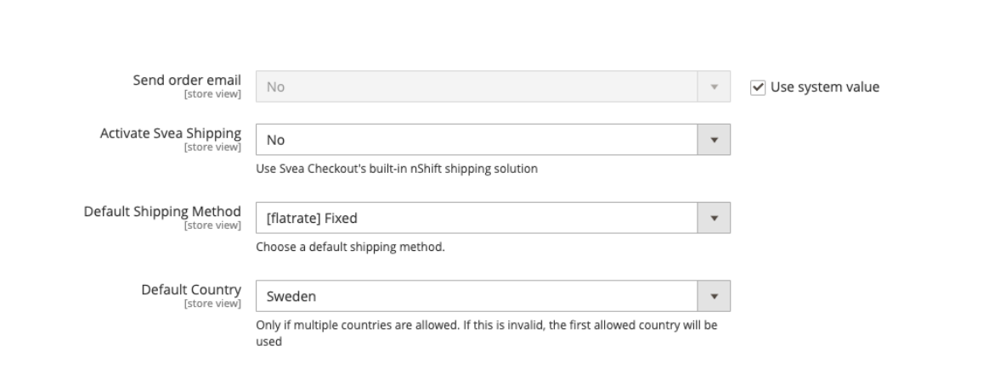
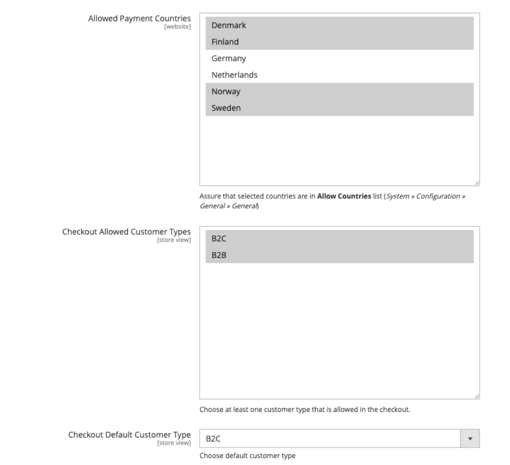
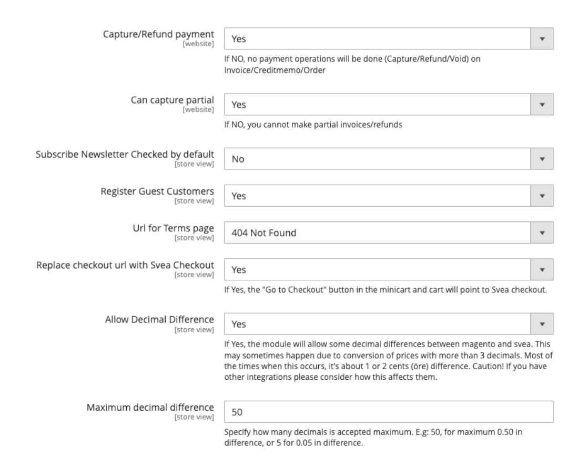
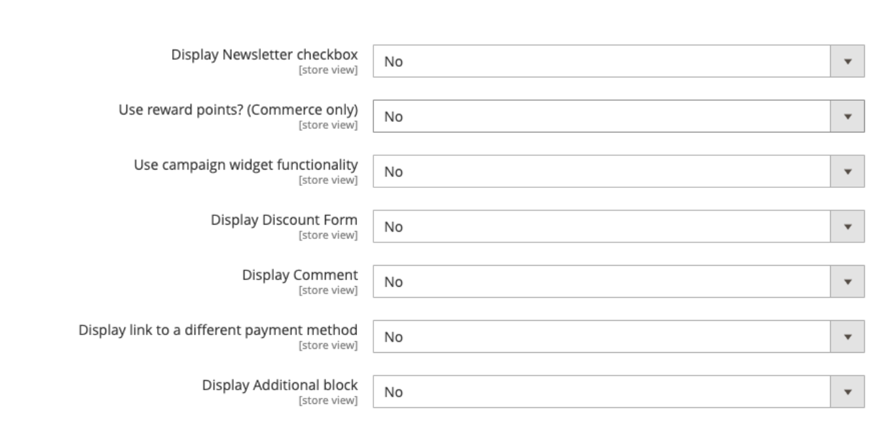
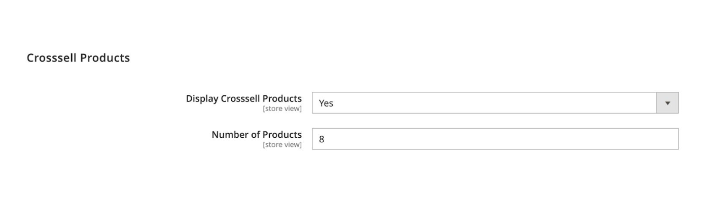

# Svea checkout settings and instructions
## How to install:
Install it to via composer in your magento site:   
```
composer config repositories.svea_checkout vcs  
composer require --prefer-source sveawebpay/nwt-magento2-checkout
```

If you don't want to use composer, install it manually:  
download and copy all files into app/code/Svea/Checkout/ directory.   
### Enable it in Magento:
` php bin/magento module:enable --clear-static-content Svea_Checkout`   
` php bin/magento setup:upgrade`   
` php bin/magento setup:di:compile`
## Settings and instructions:
To find the settings follow these steps: Store->Configuration or on the left side in the panel.  
Then you can find the settings under: Svea->Checkout.  

  


*Enabled*:  Yes/No, If you want to enable the checkout choose "Yes", if not choose "No".

*Testmode:*  Before you go live it's always good to test the checkout. Choose "Yes" to put the module in test mode so you can check if everything works as it should. When that is done, put the setting as "No" for live mode.

*Merchant ID and Shared Secret:* Merchant identifier for testing purpose see this:  
[https://www.svea.com/globalassets/sweden/foretag/betallosningar/e-handel/integrationspaket-logos-and-doc.-integration-test-instructions-webpay/test-instructions-payments-partners.pdf](https://www.svea.com/globalassets/sweden/foretag/betallosningar/e-handel/integrationspaket-logos-and-doc.-integration-test-instructions-webpay/test-instructions-payments-partners.pdf)  

For production credentials you need to contact Svea.



*Send order email:* This will prompt Magento to send out order e-mails

*Activate Svea Shipping:* A shipping service with third party TA nShift. Needs to be setup by Svea and nShift.

*Enforce Fallback Shipping Options:* Only shown if "Activate Svea Shipping" is enabled. Enforce the use of fallback shipping options in the Svea nShift solution. Leave this off unless specifically testing fallbacks.

*Activate Dimensions Calculations:* Only shown if "Activate Svea Shipping" is enabled. Parameters height_cm, width_cm, length_cm to nShift, calculated from product attributes with those same attribute codes.

*Default Shipping Method:* If you want a specific shipping method to be chosen directly.

*Default Country:* This is only important if you allow payments from multiple countries. If only 1 country is in use it will automatically choose the one from "Allowed Payment Countries".



*Allowed Payment Countries:* If you allow more than 1 payment country choose which oneshere.

*Checkout allowed customer types:* If you want to have both B2C and B2B in your checkout.

*Checkout default customer type:* Chooses which of either to be setup as default.



*Capture/Refund payment:* Allows you to capture and refund from Magento admin.

*Can capture partial:* Allows you to make partial captures/refunds.

*Subscribe Newsletter checked by default:* When reaching checkout, this decides if the checkbox for subscription to newsletter is marked or not.

*Register Guest Customers:* If you want to register not logged in customers when the order is placed.

*Url for terms page*: This is where you choose what page the "Terms and agreements" link in checkout should lead to.

*Replace checkout url with Svea Checkout:* "Yes/No", "Yes" means that Go to checkout in minicart will lead to Svea.



*Display Newsletter checkbox*: Simple "Yes/No", yes to display the checkbox, no to hide it.

*Use reward points? (Commerce only):* Use Adobe Commerce reward points function.

*Display Discount Form:* Simple "Yes/No", yes to display the discount form, no to hide it.

*Display Comment*: If you want to disable the customer comment section in the checkout choose option "No".

*Display link to a different payment method:* If you have another payment option, choose "Yes" to display it.

*Display Additional block*: Simple "Yes/No", yes to display the additional block above checkout, no to hide it.

*Additional block Content*: This is where you choose what to show in the additional block.



*Display Crossell Products:* Simple "Yes/No", Yes to show crossell products.

*Number of products:* The amount of products shown in the slider.
